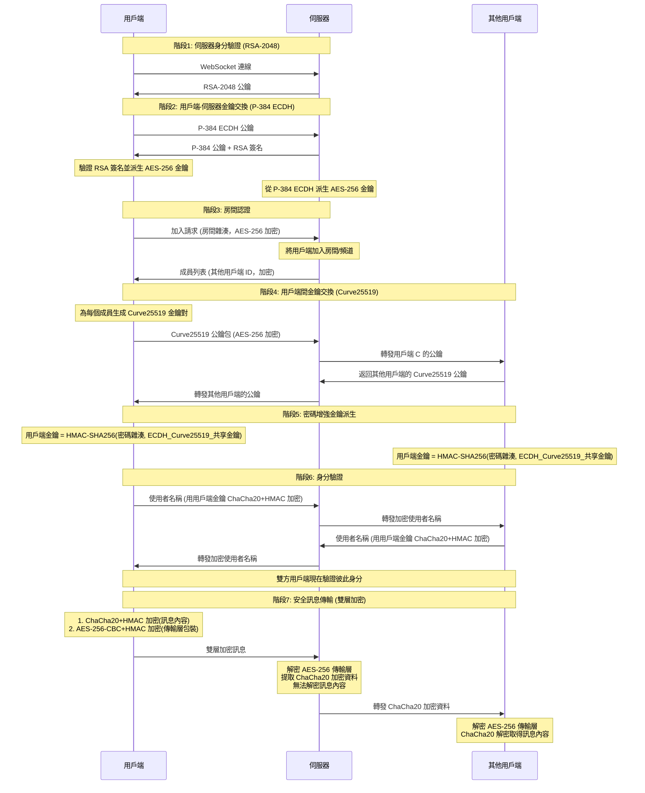

# NodeCrypt

🌐 **[English README](README_EN.md)**

## 🚀 部署說明

### 方法一：一鍵部署到 Cloudflare Workers

點擊下方按鈕即可一鍵部署到 Cloudflare Workers：
[](https://deploy.workers.cloudflare.com/?url=https://github.com/sheng1111/NodeCrypt.git)

- 建置命令：npm run build
- 部署命令：npm run deploy

> 注意：此方式會基於指定的 GitHub 倉庫建立新專案，後續倉庫更新不會自動同步。

### 方法二：自動同步 fork 並部署（推薦長期維護）
1. 先 fork 本專案到你的 GitHub 帳號。
2. 打開 Cloudflare Workers 控制台，選擇「從 GitHub 匯入」，並選擇你 fork 的倉庫進行部署。

- 建置命令：npm run build
- 部署命令：npm run deploy

> 若要自動部署，請參考下方 CI/CD 章節設定 GitHub Actions 與 Cloudflare 金鑰。

### CI/CD：GitHub Actions 自動部署到 Cloudflare Workers
1. 在 GitHub 倉庫新增 Secrets：
   - CF_API_TOKEN：Cloudflare API Token（需有 Workers 編輯權限）
   - CF_ACCOUNT_ID：Cloudflare 帳號 ID
2. 視需要更新 wrangler.toml 的 
ame，避免與既有 Worker 名稱衝突。
3. 推送到 main 後，GitHub Actions 會自動執行 
pm run build 與 
pm run deploy。


### 方法三：Docker 一鍵部署（不穩定，不建議）

```bash
docker run -d --name nodecrypt -p 80:80 ghcr.io/shuaiplus/nodecrypt
```

！ 必須開啟 HTTPS，不然傳輸金鑰會失敗，導致無法進入房間。

### 方法四：本地開發部署
克隆專案並安裝依賴後，使用 `npm run dev` 啟動開發伺服器。
使用 `npm run deploy` 部署到 Cloudflare Workers。

## 📝 專案簡介

NodeCrypt 是一個真正的端對端加密聊天系統，實現完全的零知識架構。整個系統設計確保伺服器、網路中間人、甚至系統管理者都無法取得任何明文訊息內容。所有加密與解密操作都在用戶端本地進行，伺服器僅作為加密資料的盲中繼。

### 系統架構
- **前端**：ES6+ 模組化 JavaScript，無框架依賴
- **後端**：Cloudflare Workers + Durable Objects
- **通訊**：WebSocket 即時雙向通訊
- **建置**：Vite 現代化建置工具

## 🔐 零知識架構設計

### 核心原則
- **伺服器盲轉**：伺服器永遠無法解密訊息內容，僅負責加密資料中轉
- **無資料庫儲存**：系統不使用任何持久化儲存，所有資料僅在記憶體中暫時存在
- **端對端加密**：訊息從傳送方到接收方全程加密，中間任何節點都無法解密
- **前向安全性**：即使金鑰外洩，也無法解密歷史訊息，因為根本沒有歷史訊息
- **匿名通訊**：使用者無需註冊真實身份，支援臨時匿名聊天
- **多樣體驗**：支援批量傳送圖片與檔案，可選主題與語言

### 隱私保護機制

- **即時成員提醒**：房間線上列表完全透明，任何人加入或離開都會即時通知所有成員
- **無歷史訊息**：新加入的使用者無法看到任何歷史聊天紀錄
- **私聊加密**：點擊使用者頭像可發起端對端加密的私密對話，房間內其他成員完全無法看到私訊內容

### 房間密碼機制

房間密碼作為**金鑰派生因子**參與端對端加密：`最終共享金鑰 = HMAC-SHA256(房間密碼雜湊, ECDH_共享金鑰)`

- **密碼錯誤隔離**：不同密碼的房間無法解密彼此的訊息
- **伺服器盲區**：伺服器永遠無法得知房間密碼

### 三層安全體系

#### 第一層：RSA-2048 伺服器身分驗證
- 伺服器啟動時生成臨時 RSA-2048 金鑰對，每 24 小時自動輪換
- 用戶端連線時驗證伺服器公鑰，防止中間人攻擊
- 用戶端採用 TOFU 公鑰釘選，若公鑰變更會拒絕連線（需手動清除瀏覽器儲存）
- 私鑰僅在伺服器記憶體中存在，從不持久化儲存

#### 第二層：ECDH-P384 金鑰協商
- 每個用戶端生成獨立的橢圓曲線金鑰對（P-384 曲線）
- 透過橢圓曲線 Diffie-Hellman 金鑰交換協議建立共享金鑰
- 每個用戶端與伺服器之間擁有獨立的加密通道

#### 第三層：混合對稱加密
- **伺服器通訊**：使用 AES-256-CBC 加密用戶端與伺服器間的控制訊息，並加上 HMAC-SHA256 完整性驗證
- **用戶端通訊**：使用 ChaCha20 加密用戶端之間的實際聊天內容，並加上 HMAC-SHA256 完整性驗證
- 每條訊息使用獨立的初始化向量（IV）與隨機數（Nonce）

## 🔄 完整加密流程詳解




## 🛠️ 技術實作

- **Web Cryptography API**：瀏覽器原生加密實作，提供硬體加速
- **elliptic.js**：橢圓曲線密碼學庫，實作 Curve25519 和 P-384
- **aes-js**：純 JavaScript AES 實作，支援多種模式
- **js-chacha20**：ChaCha20 流加密演算法的 JavaScript 實作
- **js-sha256**：SHA-256 雜湊演算法實作

## 🔬 安全驗證

### 加密流程驗證
使用者可透過瀏覽器開發者工具觀察完整的加密解密流程，驗證訊息在傳輸過程中確實處於加密狀態。

### 網路流量分析
使用網路抓包工具可以驗證所有 WebSocket 傳輸的資料都是不可讀的加密內容。

### 程式碼安全審計
所有加密相關程式碼完全開源，使用標準密碼學演算法，歡迎安全研究者進行獨立審計。

## ⚠️ 安全建議

- **使用強房間密碼**：房間密碼直接影響端對端加密強度，建議使用複雜密碼
- **密碼保密性**：房間密碼一旦外洩，該房間所有通訊內容都可能被解密
- **使用最新版本的現代瀏覽器**：確保密碼學 API 的安全性與效能
- **Cloudflare Zero Trust**：可用 Access 限制入口，但需允許 WebSocket 連線，避免阻擋即時通訊

### Cloudflare Zero Trust（Access）加入方式
以下以綁定自訂網域的 Workers 部署為例：

1. 在 Cloudflare Zero Trust 後台建立 Access Application：
   - Applications → Add an application → Self-hosted
   - Application domain 設為你的聊天網域（例如 `chat.example.com`）
2. 到 Application Settings 開啟 WebSocket 支援：
   - Advanced → Enable WebSockets
3. 設定 Access Policies：
   - 建議先用 `Allow` + `Email` 或 `Group` 測試
   - 若要公開測試，可用 `Bypass` 對特定 IP 或路徑
4. 確認 DNS 與路由：
   - Cloudflare DNS 指向 Workers（自訂網域或路由）
   - `wrangler.toml` 的 `routes`/`workers_dev` 需與實際網域一致

完成後用瀏覽器開啟聊天網域，應先看到 Access 驗證頁，通過後即可正常進入聊天室並使用 WebSocket。

## 🤝 安全貢獻

歡迎安全研究者回報漏洞與進行安全審計。嚴重安全問題將在 24 小時內修復。

## 📄 開源授權

本專案採用 ISC 開源授權。

## ⚠️ 免責聲明

本專案僅供學習與技術研究使用，不得用於任何違法犯罪活動。使用者應遵守所在國家和地區的相關法律法規。專案作者不承擔因使用本軟體而產生的任何法律責任。請在合法合規的前提下使用本專案。

---
## Star History

[](https://www.star-history.com/#shuaiplus/NodeCrypt&Timeline)

**NodeCrypt** - 真正的端對端加密通訊 🔐

*"在數位時代，加密是保護隱私的最後一道防線"*
